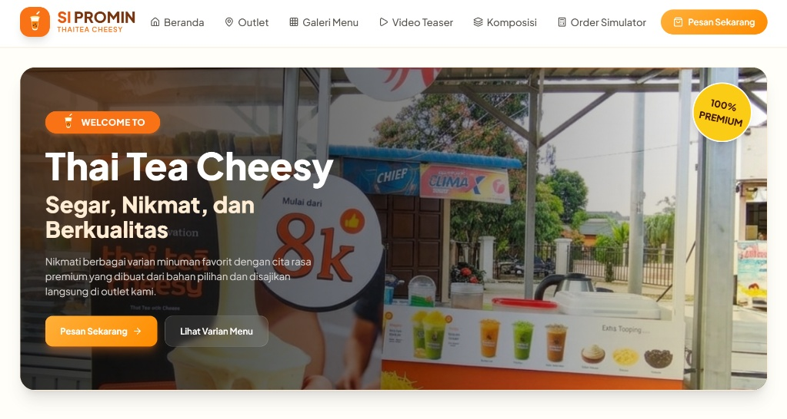
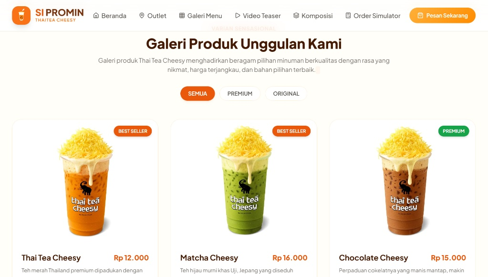
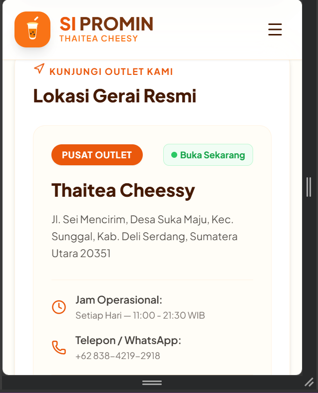

# 🧋 SI Promin - Thai Tea Cheesy Website
Website profil resmi **SI Promin Thai Tea Cheesy** yang kami kembangkan menggunakan **HTML, CSS, JavaScript,** dan **Tailwind CSS**. Website ini menerapkan konsep **Mobile-First Responsive Design** sehingga dapat diakses dengan baik melalui perangkat desktop, tablet, maupun smartphone.
Melalui website ini, kami menghadirkan informasi mengenai outlet, katalog menu, video promosi, serta tampilan antarmuka yang modern dan interaktif untuk memberikan pengalaman pengguna yang lebih baik.

## 📸 Preview Website
### 🏠 Hero Section


### 🧋 Menu Section


### 📱 Mobile View


## ✨ Fitur
* 📱 Responsive Design
* 🧋 Katalog Menu Produk
* 🔍 Filter menu berdasarkan kategori
* 🕒 Status operasional outlet secara otomatis (Buka/Tutup)
* 📍 Informasi lokasi outlet
* 🎥 Video promosi
* 🎨 Antarmuka modern dan mudah digunakan

## 🛠️ Teknologi yang Digunakan
* HTML5
* CSS3
* JavaScript
* Tailwind CSS

## 📁 Struktur Proyek

```text
SI-Promin/
├── index.html
├── img/
├── video/
├── preview/
│   ├── home.png
│   ├── menu.png
│   └── responsive.png
└── README.md
```

**Keterangan:**

* **index.html** → File utama yang berisi struktur website beserta CSS dan JavaScript.
* **img/** → Menyimpan seluruh aset gambar yang digunakan pada website.
* **video/** → Menyimpan video promosi yang ditampilkan pada website.
* **preview/** → Berisi screenshot tampilan website yang digunakan pada README.
* **README.md** → Dokumentasi proyek yang ditampilkan pada halaman utama repository GitHub.

## 🚀 Cara Menjalankan
### Clone Repository

```bash
https://github.com/Cndyy07/sipromin-thaiteacheesy.git
```

Masuk ke folder proyek, kemudian buka file **index.html** menggunakan browser.

### Atau Download ZIP
1. Klik tombol **Code** pada halaman repository GitHub.
2. Pilih **Download ZIP**.
3. Ekstrak file ZIP.
4. Buka file **index.html** menggunakan browser.

## 🎯 Tujuan Proyek
Website ini kami kembangkan sebagai media promosi digital untuk **SI Promin Thai Tea Cheesy** sekaligus sebagai implementasi pembelajaran dalam pengembangan website menggunakan teknologi front-end. Kami berharap website ini dapat membantu memperkenalkan produk dan memberikan informasi kepada pelanggan dengan cara yang lebih menarik dan mudah diakses.


## 📄 Lisensi
Proyek ini dibuat untuk keperluan edukasi, pengembangan portofolio, dan promosi bisnis SI Promin.
